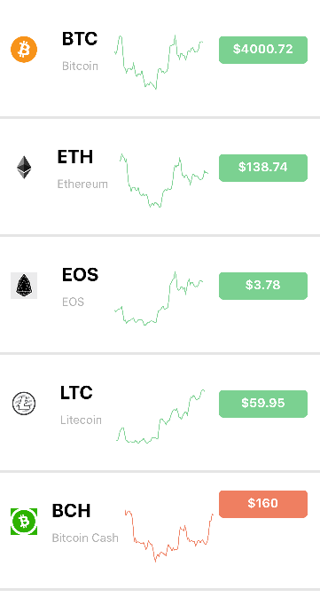

# CryptoCurrency Map

## Hassan Chadad

## Description

This is a simple react native application that shows the latest price of cryptocurrency in addition to a graph showing their average price change history.

## Running the App

1. npm install
2. react-native run-ios/android

## Double Check

"react-native-svg" needs to be linked after installation so make sure to run "react-native link react-native-svg". Or you can run "react-native link" to link all the libraries that needs linking

## Technology

- Redux and Redux-Saga
- axios library
- react-native-svg-charts to show a line chart of the history
- react-native-svg prerequisite for react-native-svg-charts

## APIs Used

The application uses 2 APIs from https://www.cryptocompare.com, they have a great documentation for the APIs. Both APIs used don't need any keys.

1. https://min-api.cryptocompare.com/data/top/totalvolfull?limit=10&tsym=USD
   returns the top 10 cryptocurrencies in USD
2. https://min-api.cryptocompare.com/data/histoday?fsym=BTC&tsym=USD&limit=75 returns the history of the price change of a cryptocurrency (change BTC in the API to another cryptocurrency)

## Limitation

I didn't implement a button or a feature to reload the data in the page. So you need to open the app again to see new data.
